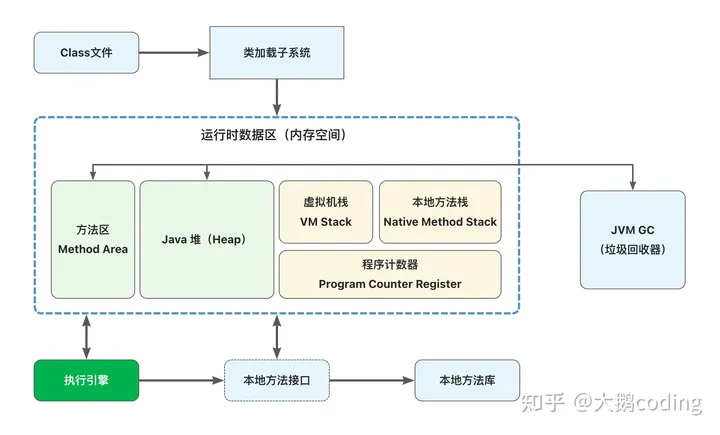

# Java JVM 运行机制及基本原理


## jvm生命周期

JVM在Java程序开始运行的时候，它才运行，程序结束的时它就停止。

一个Java程序会开启一个JVM进程，如果一台机器上运行3个Java程序，那么就会有3个运行中的JVM进程。

JVM中的线程分为两种：守护线程和普通线程

守护线程是JVM自己使用的线程，比如垃圾回收（GC）就是一个守护线程。

普通线程一般是Java程序的线程，只要JVM中有普通线程在执行，那么JVM就不会停止。


**结束生命周期**

在如下几种情况下，Java虚拟机将结束生命周期 

1、执行了System.exit()方法 

2、程序正常执行结束 

3、程序在执行过程中遇到了异常或错误而终止进程

4、由于操作系统出现错误而导致Java虚拟机进程终止


## JVM结构体系



### class文件

Class文件由Java编译器生成，我们创建的.Java文件在经过编译器后，会变成.Class的文件，这样才能被JVM所识别并运行。

Class文件的核心设计思想是 **`平台无关性`**，它存储的不是操作系统可以直接识别的二进制本地机器码，而是根据Java虚拟机规范所自定义的指令集、符号表和一些其他信息，所以只要任何一个操作系统下开发有对应的Java虚拟机，开发者的Java程序就能跑起来。


### **类加载子系统（**类加载器）

JVM默认提供三个类加载器：

1. **Bootstrap ClassLoader** ：称之为启动类加载器，是最顶层的类加载器，**负责加载JDK中的核心类库，如 rt.jar、resources.jar、charsets.jar等**。
2. **Extension ClassLoader**：称之为扩展类加载器，负责加载Java的扩展类库，默认加载$JAVA_HOME中jre/lib/*.jar 或 -Djava.ext.dirs指定目录下的jar包。
3. **App ClassLoader**：称之为系统类加载器，负责加载应用程序classpath目录下所有jar和class文件。


除了Java默认提供的三个加载器之外，我们还可以根据自身需求自定义ClassLoader，自定义的类加载器必须继承自 java.lang.ClassLoader 类。


**除了 BootStrap ClassLoader 之外**的两个默认加载器都是继承自 java.lang.ClassLoader ，BootStrap ClassLoader 不是一个普通的Java类，它底层由C++编写，已嵌入到了JVM的内核当中，当JVM启动后，BootStrap ClassLoader 也随之启动，负责加载完核心类库，并构造Extension ClassLoader 和App ClassLoader 类加载器。


类加载器子系统不仅仅负责定位并加载类文件，它还严格按照以下步骤做了很多事情：

```text
1、加载：寻找并导入Class文件的二进制信息
2、连接：进行验证、准备和解析
     1）验证：确保导入类型的正确性
     2）准备：为类型分配内存并初始化为默认值
     3）解析：将字符引用解析为直接引用
3、初始化：调用Java代码，初始化类变量为指定初始值
```

详见  <a href="./Java类加载机制.md" style="color: blue;">Java类加载机制</a>


### 方法区（Method Area）

方法区用于存储JVM加载完成的  **类型信息、常量、静态变量、即时编译器编译后的代码缓存** ，方法区和 Java 堆区一样，都是线程共享的内存区域。

在JDK8以前，使用永久代的方式来实现方法区，JDK8以后，永久代的概念被废弃了，方法区改用和 JRockit、J9一样的在本地内存中实现的元空间（Meta Space）来代替，好处是元空间会在运行时根据需要动态调整，只要没有超过当前进程可用的内存上限（32位和64位系统各不相同），就不会出现溢出的问题。

方法区也可以被垃圾回收，但条件非常严苛，必须在该类没有任何引用的情况下，详情可以参考：

<a href="./JVM GC（垃圾回收机制）.md" style="color: blue;">JVM GC（垃圾回收机制）</a>


当需要扩展时空间不足，会分别 OutOfMemoryError 异常。


