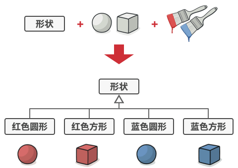
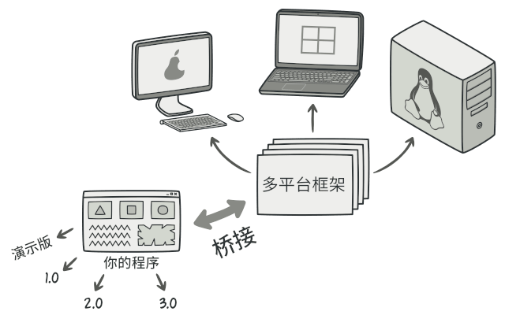
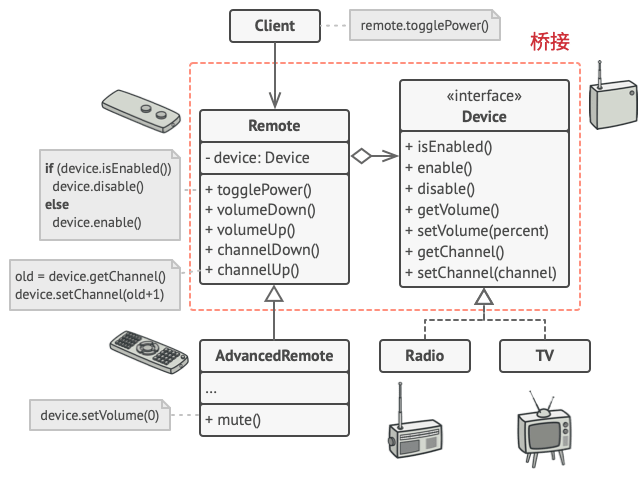

# 桥接模式

将M*N个类优化为M+N个类

## 意图

**桥接模式**是一种结构型设计模式， 可将一个大类或一系列紧密相关的类拆分为抽象和实现两个独立的层次结构， 从而能在开发时分别使用。

## 举例

假如你有一个几何 `形状`Shape类， 从它能扩展出两个子类：  `圆形`Circle和 `方形`Square 。 你希望对这样的类层次结构进行扩展以使其包含颜色， 所以你打算创建名为 `红色`Red和 `蓝色`Blue的形状子类。 但是， 由于你已有两个子类， 所以总共需要创建四个类才能覆盖所有组合， 例如 `蓝色圆形`Blue­Circle和 `红色方形`Red­Square 。

在层次结构中新增形状和颜色将导致代码复杂程度指数增长。 例如添加三角形状， 你需要新增两个子类， 也就是每种颜色一个； 此后新增一种新颜色需要新增三个子类， 即每种形状一个。 如此以往， 情况会越来越糟糕。

## 解决方案

问题的根本原因是我们试图在两个独立的维度——形状与颜色——上扩展形状类。 这在处理类继承时是很常见的问题。

桥接模式通过将继承改为组合的方式来解决这个问题。 具体来说， 就是抽取其中一个维度并使之成为独立的类层次， 这样就可以在初始类中引用这个新层次的对象， 从而使得一个类不必拥有所有的状态和行为。

根据该方法， 我们可以将颜色相关的代码抽取到拥有 `红色`和 `蓝色`两个子类的颜色类中， 然后在 `形状`类中添加一个指向某一颜色对象的引用成员变量。 现在， 形状类可以将所有与颜色相关的工作委派给连入的颜色对象。 这样的引用就成为了 `形状`和 `颜色`之间的桥梁。 此后， 新增颜色将不再需要修改形状的类层次， 反之亦然。

## 抽象部分和实现部分

*抽象部分* （也被称为*接口*） 是一些实体的高阶控制层。 该层自身不完成任何具体的工作， 它需要将工作委派给*实现部分*层 （也被称为*平台*）。

注意， 这里提到的内容与编程语言中的***接口***或***抽象类***无关。 它们并不是一回事。

在实际的程序中， 抽象部分是图形用户界面 （GUI）， 而实现部分则是底层操作系统代码 （API）， GUI 层调用 API 层来对用户的各种操作做出响应。

一般来说， 你可以在两个独立方向上扩展这种应用：

- 开发多个不同的 GUI （例如面向普通用户和管理员进行分别配置）
- 支持多个不同的 API （例如， 能够在 Windows、 Linux 和 macOS 上运行该程序）。

在最糟糕的情况下， 程序可能会是一团乱麻， 其中包含数百种条件语句， 连接着代码各处不同种类的 GUI 和各种 API。

你可以将特定接口-平台的组合代码抽取到独立的类中， 以在混乱中建立一些秩序。 但是， 你很快会发现这种类的数量*很多*。 类层次将以指数形式增长， 因为每次添加一个新的 GUI 或支持一种新的 API 都需要创建更多的类。

让我们试着用桥接模式来解决这个问题。 该模式建议将类拆分为两个类层次结构：

- 抽象部分： 程序的 GUI 层。
- 实现部分： 操作系统的 API。

抽象对象控制程序的外观， 并将真实工作委派给连入的实现对象。 不同的实现只要遵循相同的接口就可以互换， 使同一 GUI 可在 Windows 和 Linux 下运行。

最后的结果是： 你无需改动与 API 相关的类就可以修改 GUI 类。 此外如果想支持一个新的操作系统， 只需在实现部分层次中创建一个子类即可。

# 举例

**`设备`Device**类作为实现部分， 而 **`遥控器`Remote**类则作为抽象部分。

